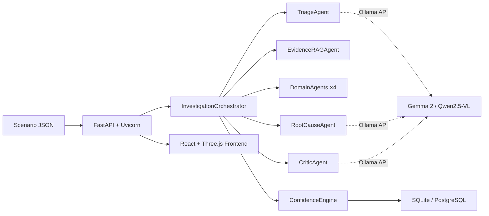
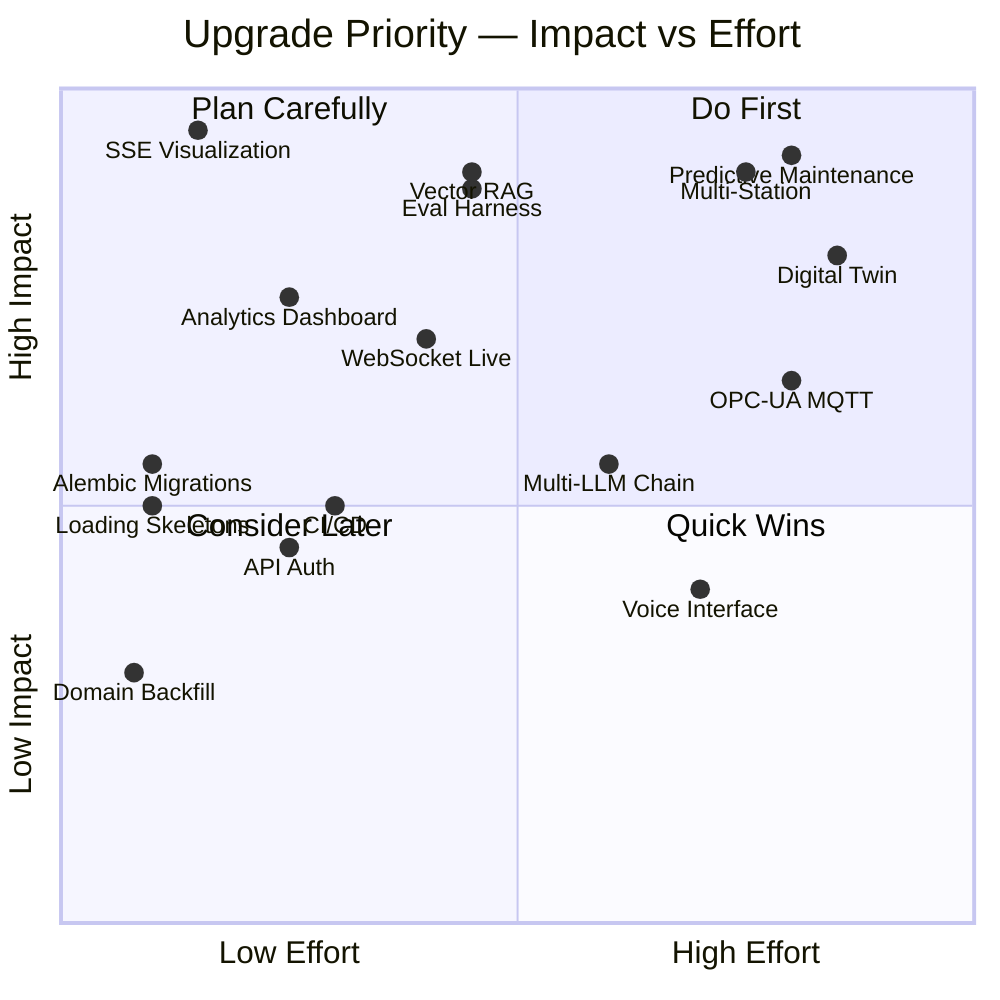

# ReliAI — Next Upgrades Roadmap
**Generated:** 2026-09-04 · **Current State:** 4,610 LOC · 47 tests · 5 scenarios · 8 domains · 7 agents

---

## Current Architecture Snapshot



---

## 🟢 Tier 1 — Quick Wins (1-2 days each)

### 1. Real-Time SSE Investigation Visualization
**Impact:** ⭐⭐⭐⭐⭐ · **Effort:** 1 day · **Dependencies:** None

**What:** The backend already emits SSE events via `/harness/investigate/stream`, but the frontend uses the synchronous `/scenarios/{id}/trigger` endpoint and waits for the full result. Connect the frontend directly to the SSE stream so users see each agent deliberate in real-time.

**How:**
- Replace `triggerScenarioInvestigation()` in `api.js` with an `EventSource` or `fetch` with `ReadableStream`
- Feed each SSE event into `AgentDeliberationGraph` as it arrives (triage → evidence → domain → root cause → critic → verdict)
- Add a pulsing "thinking" animation on the currently active agent node
- The 3D RobotViewer can highlight the affected joint as soon as triage identifies it, before the full verdict

**Why it matters:** This is the single most impressive demo feature. Right now the UI freezes for 30-90 seconds during investigation. Streaming makes it feel alive.

---

### 2. Alembic Database Migrations
**Impact:** ⭐⭐⭐ · **Effort:** 0.5 days · **Dependencies:** None

**What:** Currently, schema changes require deleting the entire SQLite database. Add Alembic for version-controlled migrations.

**How:**
```bash
pip install alembic
alembic init alembic
# Configure alembic.ini with DATABASE_URL
alembic revision --autogenerate -m "initial schema"
```
- Add `alembic upgrade head` to the `lifespan()` startup sequence
- Add `alembic/` to `.gitignore` env section (keep `versions/` tracked)

**Why it matters:** You have 100+ incidents in the DB already. Losing them on every schema change is unacceptable for any demo or deployment.

---

### 3. Investigation Analytics Dashboard Page
**Impact:** ⭐⭐⭐⭐ · **Effort:** 1-2 days · **Dependencies:** None

**What:** A new `/analytics` page with aggregated statistics from the DB.

**Metrics to display:**
| Metric | Source |
|---|---|
| Incidents by domain (pie chart) | `GROUP BY domain` |
| Confidence score distribution (histogram) | `final_confidence_score` |
| Average investigation time by scenario | `agent_traces` timestamps |
| Approval rate vs. override rate | `approval_audits` |
| Token throughput over time | `ollama_client` instrumentation |
| Stuck/failed incident count | `status = FAILED` |

**How:** Use [Recharts](https://recharts.org) (already React-compatible) for charts. Add 2-3 new API endpoints: `GET /api/v1/analytics/summary`, `/analytics/domain-breakdown`, `/analytics/confidence-distribution`.

---

### 4. Backfill `domain` Column for Existing Records
**Impact:** ⭐⭐ · **Effort:** 0.5 days · **Dependencies:** None

**What:** 131 existing records have `domain = NULL`. Write a one-time migration script that reads each incident's `agent_traces` → TRIAGE_AGENT COMPLETED → `payload_json.incident_domain` and backfills it.

```python
# scripts/backfill_domain.py
for incident in all_incidents_with_null_domain:
    triage_trace = get_triage_completed_trace(incident.id)
    if triage_trace and triage_trace.payload_json:
        incident.domain = triage_trace.payload_json["incident_domain"]
```

---

### 5. Frontend Loading Skeleton During Investigation
**Impact:** ⭐⭐⭐ · **Effort:** 0.5 days · **Dependencies:** None

**What:** When a scenario is triggered, the telemetry panels update instantly but the verdict/traces show stale data. Add a shimmer skeleton overlay on `AgentDeliberationGraph`, `CriticDebateView`, and `HumanApprovalBar` while `isInvestigating === true`.

---

## 🟡 Tier 2 — Medium Effort (3-5 days each)

### 6. True Vector RAG — Replace Threshold Math with Embeddings
**Impact:** ⭐⭐⭐⭐⭐ · **Effort:** 3-4 days · **Dependencies:** None

**What:** The current `EvidenceRAGAgent` is 27 lines of deterministic threshold math — it compares sensor values to golden specs and returns deviations. It works for 5 scenarios but won't scale to unknown fault modes.

**Upgrade Path:**
1. **Embed all SOPs and historical incident verdicts** using Ollama's embedding endpoint (`/api/embeddings` with `nomic-embed-text`)
2. **Store embeddings** in a local vector store (ChromaDB or LanceDB — both run embedded, no infra needed)
3. **At investigation time:** embed the current telemetry snapshot description → retrieve top-K similar historical incidents and relevant SOPs → feed them as grounded context to the RootCauseAgent prompt

**Architecture:**
```
Telemetry Snapshot → Text Summary → Embed → Vector Search → Top-5 Similar Incidents
                                                           → Top-3 Matching SOPs
                                                           ↓
                                               RootCauseAgent Prompt (grounded)
```

**Why it matters:** This is the difference between a "demo with 5 scenarios" and a "system that can handle novel faults". It's also the most technically defensible upgrade for any review or presentation.

---

### 7. WebSocket Live Dashboard
**Impact:** ⭐⭐⭐⭐ · **Effort:** 3 days · **Dependencies:** Upgrade #1 (SSE)

**What:** Replace SSE with WebSocket for bidirectional communication. This enables:
- Live investigation progress (already possible with SSE)
- **Client-initiated cancellation** mid-investigation (not possible with SSE)
- **Multi-client sync** — all connected browsers see the same investigation progress
- **Push notifications** — server alerts clients when new incidents arrive from IoT

**How:** FastAPI has native WebSocket support. Use `fastapi.WebSocket` with a connection manager that broadcasts events to all connected clients.

---

### 8. Evaluation & Benchmarking Harness
**Impact:** ⭐⭐⭐⭐⭐ · **Effort:** 3-4 days · **Dependencies:** None

**What:** An automated evaluation framework that runs all 5 scenarios (and future ones) through the pipeline and scores outputs against expected results.

**Structure:**
```
evaluation/
├── expected_outcomes.json     # Ground truth for each scenario
├── run_evaluation.py          # Orchestrates all scenarios
├── scoring.py                 # Compares verdict vs expected
└── reports/                   # Generated HTML/MD reports
```

**Metrics to track per scenario:**
| Metric | Target |
|---|---|
| Correct domain identified | 100% |
| Correct root cause title match | > 80% keyword overlap |
| Confidence score within ±10% of expected | Yes |
| Investigation time | < 90 seconds |
| Tokens per second | > 10 tok/s |
| Hallucination rate (fabricated evidence IDs) | 0% |
| Contradiction correctly detected (Scenario 3) | Yes |

**Why it matters:** You can't improve what you can't measure. This turns "it seems to work" into "it scores 94.2% on our eval suite."

---

### 9. CI/CD Pipeline
**Impact:** ⭐⭐⭐ · **Effort:** 2 days · **Dependencies:** None

**What:** GitHub Actions workflow that runs on every push:
```yaml
# .github/workflows/ci.yml
jobs:
  test:
    runs-on: ubuntu-latest
    steps:
      - uses: actions/checkout@v4
      - uses: actions/setup-python@v5
        with:
          python-version: '3.12'
      - run: pip install -r requirements.txt
      - run: python -m pytest tests/ -v --tb=short
  
  lint:
    runs-on: ubuntu-latest
    steps:
      - run: ruff check harness/ web_backend/ tests/
  
  build-frontend:
    runs-on: ubuntu-latest
    steps:
      - run: npm ci && npm run build
```

---

### 10. Authentication & API Keys
**Impact:** ⭐⭐⭐ · **Effort:** 2 days · **Dependencies:** None

**What:** Add lightweight API key auth for all mutation endpoints. No full user management needed — just a shared secret for the factory floor deployment.

**How:**
- `X-API-Key` header checked via FastAPI `Depends()` middleware
- Keys stored in environment variable `RELIAI_API_KEYS` (comma-separated)
- Read-only endpoints (`/health`, `/scenarios`, `GET /incidents`) remain open
- Mutation endpoints (`/trigger`, `/approve`, `/cancel`) require valid key

---

## 🔵 Tier 3 — Big Bets (1-2 weeks each)

### 11. Multi-Station Fleet View
**Impact:** ⭐⭐⭐⭐⭐ · **Effort:** 1-2 weeks · **Dependencies:** Upgrades #1, #3

**What:** Scale from a single robotic cell to a factory floor with multiple stations. Each station is an independent investigation target.

**Frontend:** A top-level "Fleet Map" view showing all stations as cards/nodes with real-time status badges (🟢 Nominal, 🟡 Investigating, 🔴 Fault Detected). Click any station to drill into its investigation view.

**Backend:** Add `station_id` as a first-class routing dimension. Each station gets its own telemetry stream and investigation pipeline. The `InvestigationOrchestrator` already accepts `station_id` — extend it to manage per-station queues.

**Database:** Add a `stations` table with metadata (location, robot model, last calibration date, maintenance schedule).

---

### 12. Predictive Maintenance — Trend Analysis
**Impact:** ⭐⭐⭐⭐⭐ · **Effort:** 1-2 weeks · **Dependencies:** Upgrades #3, #6

**What:** Instead of only reacting to faults, predict them by analyzing telemetry trends over time.

**How:**
1. Store raw telemetry snapshots in a time-series format (append to a `telemetry_history` table with timestamp)
2. Calculate rolling averages and standard deviations for key sensors (joint temperature, motor current, pneumatic pressure)
3. When a sensor's rolling average crosses a warning threshold (e.g. 80% of alarm limit), proactively trigger a "PREDICTIVE" investigation
4. Add a `PREDICTIVE_WARNING` status to `InvestigationStatus`

**Example:** If Joint 3 temperature has been trending upward over the last 50 cycles (32°C → 45°C → 58°C → 62°C), the system proactively flags "Joint 3 Harmonic Drive approaching thermal limit — schedule preventive lubrication" before it hits 80°C and triggers a full alarm.

---

### 13. Digital Twin Simulator
**Impact:** ⭐⭐⭐⭐ · **Effort:** 2 weeks · **Dependencies:** Upgrade #11

**What:** Replace static scenario JSONs with a live physics-based simulator that generates realistic telemetry streams.

**Components:**
- A simple kinematic model of the 6-axis robotic arm (joint angles, torques, velocities)
- Thermal model (heat generation from motor current, passive cooling, ambient temperature)
- Fault injection engine (gradually degrade bearing, introduce leak, simulate voltage sag)
- Continuous telemetry emission at configurable frequency (1 Hz for demo, 100 Hz for stress test)

**Why it matters:** This turns the demo from "replay a canned scenario" into "watch the robot degrade in real-time and see the AI catch it." It's the most visually impressive possible upgrade.

---

### 14. Multi-LLM Fallback Chain
**Impact:** ⭐⭐⭐ · **Effort:** 1 week · **Dependencies:** None

**What:** Instead of being locked to Gemma 2 via Ollama, support a fallback chain:

```
Gemma 2 (local, fast, free)
  ↓ if unavailable or confidence < 60%
Qwen 2.5 (local, different perspective)
  ↓ if unavailable
Claude API (cloud, high quality, paid)
  ↓ if unavailable
Deterministic Rule Engine (current mock fallback)
```

**Benefits:**
- If Ollama is down, investigations still run via cloud API
- Low-confidence local results can be re-evaluated by a stronger model
- A/B comparison between local and cloud model quality

---

## 🟣 Tier 4 — Moonshots

### 15. Voice-Activated Factory Floor Interface
Use Gemini Live API or Whisper for voice commands: "Hey ReliAI, what happened on Station 3 last shift?" → spoken summary of incident history and current status.

### 16. OPC-UA / MQTT Industrial Protocol Integration
Connect to real PLCs and industrial controllers via OPC-UA or MQTT brokers instead of JSON file ingestion. This makes ReliAI deployable on actual factory floors.

### 17. Federated Learning Across Plants
Train a shared anomaly detection model across multiple factory deployments without sharing raw telemetry data. Each plant contributes gradient updates to a central model.

### 18. AR Overlay for Maintenance Technicians
Use the Vision Agent's thermal/acoustic analysis to generate AR overlays showing exactly where the fault is on the physical robot — displayed on a tablet or AR headset.

---

## Priority Matrix



---

## Suggested Execution Order

| Phase | Upgrades | Timeline |
|---|---|---|
| **Sprint 1** (This week) | #1 SSE Viz, #2 Alembic, #4 Domain Backfill, #5 Loading Skeletons | 3 days |
| **Sprint 2** (Next week) | #3 Analytics Dashboard, #8 Eval Harness, #9 CI/CD | 5 days |
| **Sprint 3** (Week 3) | #6 Vector RAG, #10 API Auth | 5 days |
| **Sprint 4** (Week 4) | #7 WebSocket Live, #14 Multi-LLM Chain | 5 days |
| **V2 Milestone** (Month 2) | #11 Multi-Station, #12 Predictive Maintenance | 2 weeks |
| **V3 Milestone** (Month 3) | #13 Digital Twin, #15-18 Moonshots | Ongoing |

---

## Technical Debt to Address Alongside

| Debt | Where | Fix |
|---|---|---|
| `EvidenceRAGAgent` is 27 LOC of threshold math labeled "RAG" | `harness/agents/evidence_rag_agent.py` | Rename to `EvidenceBaselineAgent` or upgrade to actual RAG (#6) |
| No frontend tests | `src/` | Add Vitest + React Testing Library (with #9 CI/CD) |
| `httpx` deprecation warning in test client | `requirements.txt` | Add `httpx2` when Starlette officially requires it |
| 131 records with `domain = NULL` | `reliai.db` | Run backfill script (#4) |
| No structured logging (JSON) | `main.py` | Switch to `structlog` or `python-json-logger` |
| No request tracing / correlation IDs | `router.py` | Add `X-Request-ID` middleware for distributed tracing |

---

*Roadmap generated from codebase analysis: 4,610 LOC · 12 test files · 5 scenarios · 8 domains · 7 agents · 100 DB incidents*
